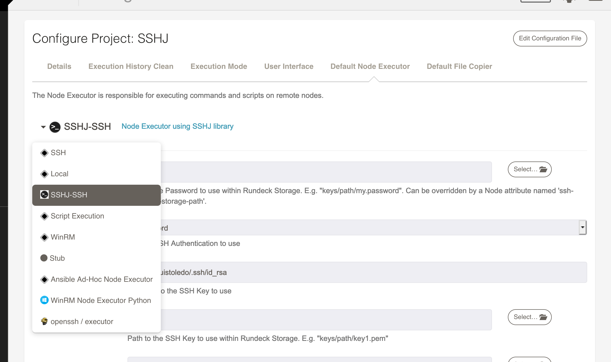
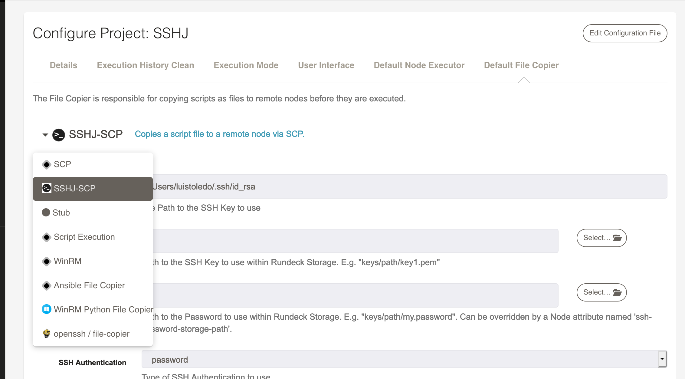
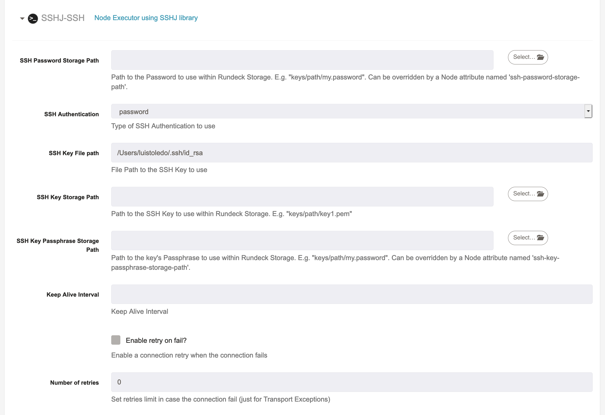

# sshj-plugin Rundeck Plugin

This is a node executor / File Copier plugin based on [SSHJ](https://github.com/hierynomus/sshj) library

## Build and Install

```
./gradlew clean && ./gradlew build 

cp build/libs/sshj-plugin-x.x.x.jar $RDECK_BASE/libext
```

## How to use

This plugin has the same configuration names than the default JSCH plugin, so most of this [documentation](https://docs.rundeck.com/docs/administration/projects/node-execution/ssh.html)  works for this plugin.

### Set it at project level

Go to `Project Settings > Edit Configuration` to set the SSHJ plugin at project level

* Node Executor



* File Copier



* Settings



### Set at node level

Use `node-executor` and `file-copier` node attributes to use SSHJ plugin at node level.

```
Demo-Ubuntu:
  nodename: Demo-Ubuntu
  hostname: 192.168.100.18
  description: Ubuntu 20
  username: samuel
  osFamily: unix
  node-executor: sshj-ssh
  file-copier: sshj-scp
  tags: ubuntu
  ssh-password-option: option.password
  sudo-command-enabled: 'true'
  sudo-password-storage-path: keys/node/sudo.password
  ssh-password-storage-path: keys/node/samuel.password
```

# Status

- [X] Key Storage Password Authentication
- [x] File Key Authentication 
- [x] Key Storage Key Authentication (it works with a creating a temp file from key storage, TODO: https://github.com/hierynomus/sshj/issues/350#issuecomment-336457625)
- [x] Passphrase 
- [x] Env Variables 
- [X] Sudo Commands (Experimental, works with [Java ExpectIt lib](https://github.com/Alexey1Gavrilov/ExpectIt))
- [X] Username from input option
- [X] Password from input option
- [X] Sudo Password from input option
- [X] Passphrase from input option
- [X] Keep alive
- [X] File Transfer Single File
- [ ] File Transfer Multiples File
